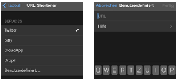
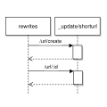

## chronik of the idea
As user of the third-party twitter app [Tweetbot](http://tapbots.com/software/tweetbot/) some day i discovered the customization for the URL shortening. 



After hacking a little prototype CouchApp i had to face a problem has gone down with all the enthusiasm: Tweetbot requests my URL shortener via GET request and the CouchDB always answers with `method_not_allowed`.

A hotfix was to setup a simple [nodejs express route](http://expressjs.com/guide.html) which has proxified the GET calls to POSTs. But that couldn't be more then a hotfix - so maybe a review of the CouchDB source code could give some answers.  

[JChris](https://github.com/jchris) commited [at the end of 2009](https://github.com/apache/couchdb/blame/master/share/server/render.js#L272) the following code into CouchDB's `share/server/render.js`:

```js
// for analytics logging applications 
// you might want to remove the next line
if (method == "GET")
  throw([
    "error",
    "method_not_allowed",
    "Update functions do not allow GET"
  ]);
```

So, without the [line 273](https://github.com/apache/couchdb/blame/master/share/server/render.js#L272) in the `render.js` the GET requests can trigger document updates - for sure, the only ways to send data within are the query and header key/value's. 

Hint: A quick and dirty test is possible by commenting out the line in an already installed CouchDB - the render.js is one of several ressources which are merged together into the `share/couchdb/server/main.js` during the build process. But be aware that this file shouldn't be edited manually in common as can be read in the first line `// DO NOT EDIT THIS FILE BY HAND`.

## URL shortening

To be clear, the following approach enables redirects via 302 HTTP status code - useful for **redirects to ressouces outside the CouchDB**. The client (e.g. browser) has to follow the redirect by itself in an additional second request.

The CouchDB rewriting capability - vhost+rewrite-handler - are used to form the API only (redirecting to service execution logic).

The URL shortening has two major services:

1. create a short URL (~20 characters) that points to the longer URL
2. redirect/forward every request of the short URL to the longer URL

Tweetbot's [documentation](http://tapbots.net/tweetbot/custom_url/) describes:

```js
Custom URL Shortener
The request will be replace the %@ string with the URL that needs to be shortened.

The response should be one of the following formats:
URL
{ status_code : 200, data : { url : URL } }
{ shortURL : URL }
{ shorturl : URL }

Examples:
domain.tld/api/v1/cligs/create?url=%@
domain.tld/api?u=%@&i=0
domain.tld/api.php?u=%@
```

Let's create short URLs with a CouchDB update handler. The API endpoint should be `/url` for now but can be changed or removed in a custom installation. Example given when the shortening service has an own (sub-)domain.
The resulting endpoint paths are:

* **read/delete url:** GET,DELETE `/url/:id`
* **edit url:** POST,PUT `/url/:id?url=%`
* **create titled url:** GET,POST,PUT `/url/create?url=%&title=%` (/url/title)
* **create hashed url:**GET,POST,PUT `/url/create?url=%` (/url/nFgH)


Rules in the `rewrites.json`

```js
{
  "from": "url/create",
  "to": "_update/shorturl", 
  "method": "*",
  "query": {
    "path": "create"
   }
},{
  "from": "url/:pid",
  "to": "_update/shorturl/:pid",
  "method": "*"
}
```

A `short URL document schema`:

```json
{
  "_id": "test-url",
  "edited_at": "2014-02-02T16:55:26.158Z",
  "url": "http://domain.tld/path/to",
  "created_at": "2014-02-02T16:55:26.158Z",
  "type": "shorturl"
}
```

The `updates/shorturl.js` handles all requests. When the doc gets written (CREATE, EDIT, DELETE) the handler is responsive for transfering the values of query params (e.g. title, url) into the JSON schema only. Whether the values and changes are schema-conform will validate and permit the `validate_doc_update.js` later during every document update.

The query param `title` is optional with a fallback to hashes. A title/hash can not be changed later (it's the docid). Creating an existing shorturl will end in a 409 conflict. Thats not case for titled urls only - also ultra-short hashed urls can conflict.

The `validate_doc_update.js` ensures:

* `doc._id` contains URL safe chars only
* `doc.type` is valued "shorturl"
* `doc.created_at` is a date, once set never changes and not in the future
* `doc.edited_at` is a date younger then created_at, refreshs with every doc update
* `doc.url` is a url and must change with doc updates

**That's it.** 

## Demo
I have an installation running under the domain `http://url.i8z.de` with 4-chars hashs (22 characters total). 

The configuration in Tweetbot points to `http://url.i8z.de?create?url=%@` and works as expected. I decided to not shorten to a minimum (e.g. `http://u.i8z.de/xC` (18 characters)) because [Twitter shortens every url to a fix length](https://dev.twitter.com/discussions/1062) - it will end in a shortened URL which gets extended back in a second step, crazy.

* **create titled url:** [url.i8z.de/create?url=yahoo.com&title=yahoo](http://url.i8z.de/create?url=yahoo.com&title=yahoo)
* **create hashed url:** [url.i8z.de/create?url=google.com](http://url.i8z.de/create?url=google.com)
* **read url:** [url.i8z.de/yahoo](http://url.i8z.de/yahoo)
* **edit url:** POST,PUT `url.i8z.de/yahoo?url=yahoo.de`
* **delete url:** DELETE `url.i8z.de/yahoo`

how to use

- bookmarkable titled urls as proxy, e.g. /latest or /current
- hashed urls are for everything else

The full code are reviewable on [github](https://github.com/llabball/couchdb-urlshortener).