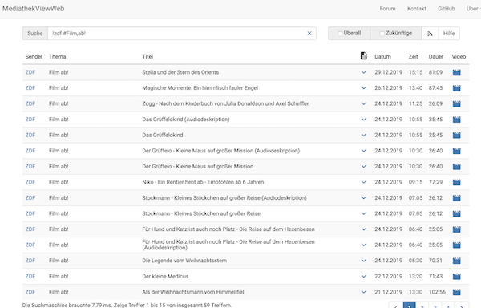

## Worum gehts?

In den Mediatheken von ARD, ZDF und den dritten Fernsehsendern in Deutschland sind besonders im Kinderbereich tolle Filme und Serien abrufbar. Leider immer nur für sieben Tage und fast ausschließlich als so genanntes Streaming-Angebot, also nur mit einer Internetverbindung nutzbar.

Die Fernsehanstalten bieten Apps und Webseiten für den Zugriff an. Obwohl diese mitunter toll gemacht sind, wünscht man sich als Eltern häufig, man könnte:

- Filme herunterladen und unterwegs anschauen
- eine eigene Kollektion zusammen stellen
- Filme auch nach sieben Tagen der Ausstrahlung anschauen

Kurzum: gesucht wird die Möglichkeit, Fernsehsendungen aufzuzeichnen - möglichst einfach und mit den aktuellen Geräten (also eher Smartphone statt Video-Recorder).

Die folgenden Erklärungen haben eine Einschränkung: sie beschreiben, wie dies mit der Podcast-App von Apple gelingt. **ABER!!!**, es gibt fantastische alternative Podcast-Apps für wirklich jedes Betriebssystem und Gerät dort draußen. Die Vorgehensweise ist dieselbe, nur die Bedienung muss man selbst erkunden.

## Das Ziel

1. Wenn ein neuer Film zur Verfügung stehen, bekommt man eine Benachrichtigung.
2. Man entscheidet, welche Filme man auf sein Gerät herunter laden möchte.
3. Man kann die herunter geladenen Filme solange und sooft anschauen, wie man möchte.

## Die Lösung

Sogenannte Podcasts sind Audio- und/oder Video-Beiträge, die ähnlich einem Fernsehprogramm regelmäßig angeboten werden. Der Anbieter stellt den Podcast so bereit, dass man diesen herunterladen und später ansehen/anhören kann.

Viele Pendler nutzen diese Möglichkeit. Sie laden einen Podcast morgens zuhause im WLan auf ihr Gerät und brauchen später unterwegs keine Internetverbindung, um den Podcast zu nutzen.

Wäre die Mediathek als Podcast verfügbar bzw. in eine Podcast-App einbindbar, wäre das Ziel erreicht. In den Podcast-Apps sucht man sich Inhalte nach eigenem Geschmack aus einem Katalog bzw. mithilfe der Suchfunktion zusammen. Darin sind die Mediatheken aber nicht enthalten. Es gibt aber zusätzlich die Möglichkeit, eine Podcast-Internetadresse zu konfigurieren.

Eine solche Internetadresse bietet die Seite [mediathekviewweb.de](https://mediathekviewweb.de/) an. Diese Podcast-Adresse kann mit der Suchfunktion der Webseite verbunden werden, d.h. man kann seine ganz eigene Podcast-Adresse kreieren. Oder man kreiert gleich mehrere und schafft thematische Gruppen. Beispielsweise beinhaltet die Podcast-Adresse: `https://mediathekviewweb.de/feed?query=!zdf #Film,ab!` alle Filme des ZDF in der Reihe "Film ab!" (ZDFTivi)

